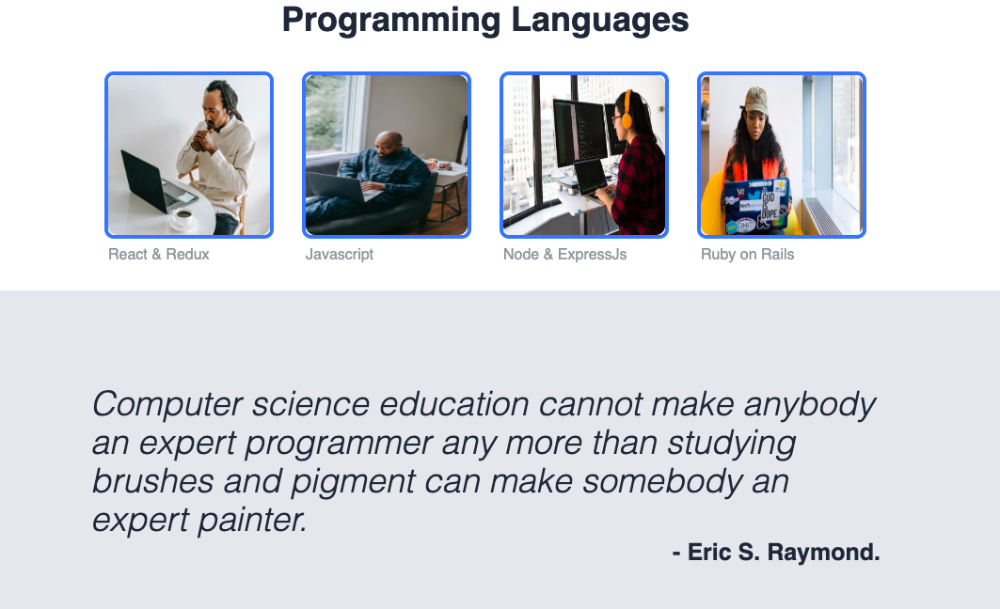
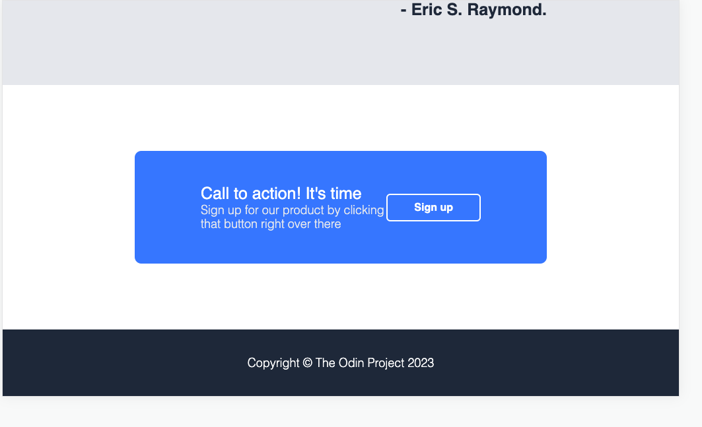

# Project Details
This is a website that talks about various programming languages including Javascript, Ruby among others

## Technologies
This website is built using HTML and CSS.
Add responsive designs to all screen-sizes. 

## Diffrent Screen-Sizes

### Desktop

Top Section

Middle Section

Lower Section

### Medium Screen size

Top Section

Middle Section

Lower Section

### Mobile Screen size

Top Section

Middle Section

Lower Section
